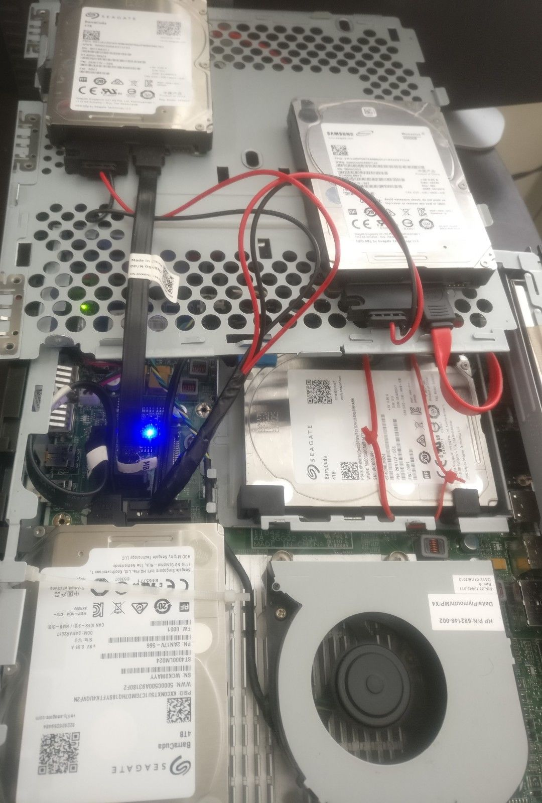
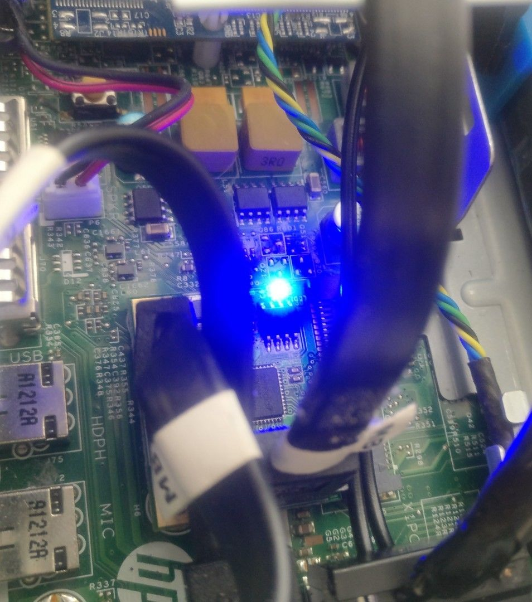

# Making Home NAS

# Hardware : 
- HP thin client [T610](http://www.parkytowers.me.uk/thin/hp/t610/index.shtml) Plus

- The miniPcie sata card

# Software
- OS : any linux(tested with Debian) with mdadm/webmin
- [openmediavault](https://openmediavault.readthedocs.io/en/latest/installation/index.html)

# Hardware spec : 
http://www.parkytowers.me.uk/thin/hp/t610/index.shtml

# Inspiration 
- Gunbee : https://www.crowdsupply.com/gnubee/personal-cloud-1
