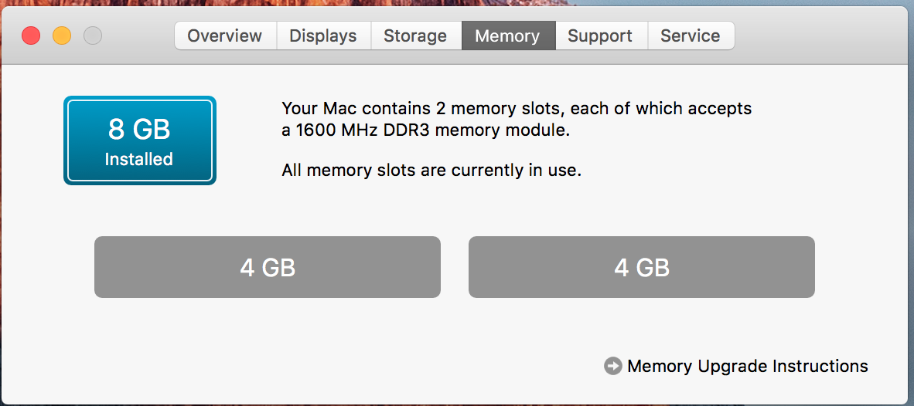

# Hackintosh ZBox-EI750-P
This will help you install hakintosh (El Capitan) in Zotac Pro 4770R. 

I am using 8gb/DDR3/1600Mhz with 16Gb mSata SSD.

Note : Wifi will not work, so I am using LAN (you need to change default wifi device compatible with MACs) 

# installation

- Read installation from here : https://www.tonymacx86.com/threads/unibeast-install-os-x-el-capitan-on-any-supported-intel-based-pc.172672/

# Zotac Specific : 

(After Step 4) I am following Alternate steps 6

A. Download El Capitan Post-Install Tools (https://www.tonymacx86.com/resources/el-capitan-post-install-tools.294/) 

1. Install Clover_v2.3k_r3320-UEFI.pkg

2. Install CustoMac Essentials.pkg

B. Download Clover configurator : (https://www.tonymacx86.com/resources/clover-configurator.335/)
- From SMBIOS , use wizard to select select MacBook Pro Retina(11,2) - core i7 haswell
- You may save it 
- Reboot 

This will be make your hard drive rebootable. 

C. Download Multibeast 8.2.3 (https://www.tonymacx86.com/resources/multibeast-el-capitan-8-2-3.319/) and run it. I configured like 
- UEFI under quick start
- Drivers/Audio : Vodoo latest (i will add specific)
- Drivers/Network : intel(i will add specific)
- Boot loader UEFI 
- Customize/Definations/Mac Pro Ratina 11,2

And install it. It will take 2/3 min. And you are done. 

working : Sound, Bluetooth, LAN
GPU is not very good at 4k (flickers, need patch), but good in 1080p.
audio = ALC 269 + optional HD3000/HD4000/HD 530HDMI (togather)

# Finally : Its running 

