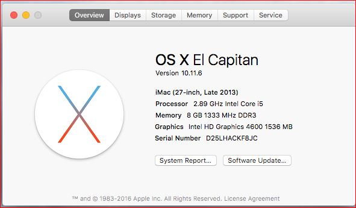
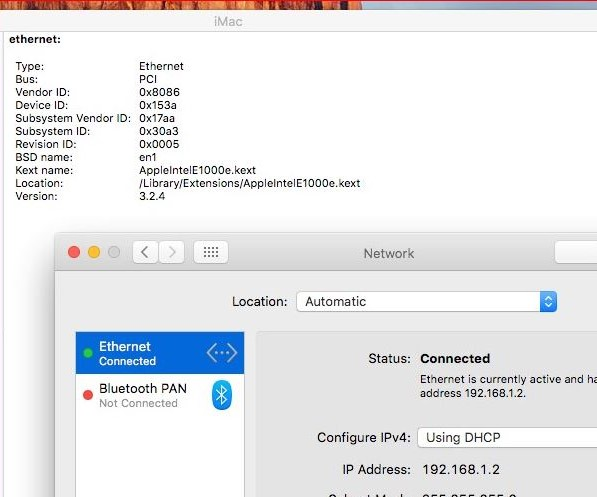
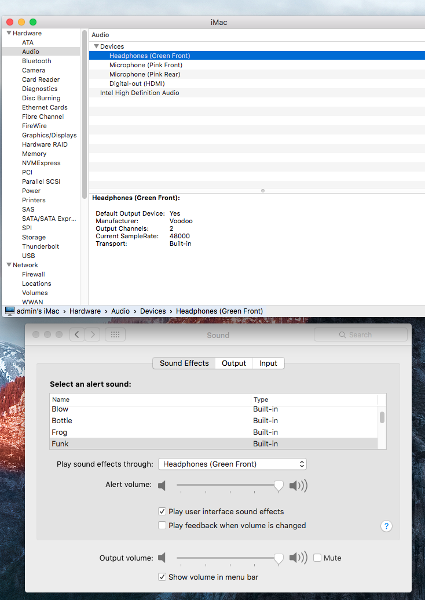
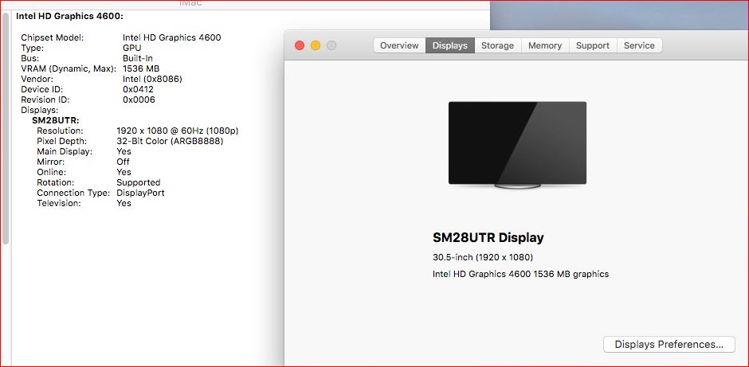
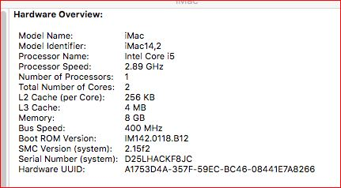

# Lenovo M93p/M83 hakintosh 

This will help you install hakintosh (El Capitan) in M93p/M83 

I am using 8gb/DDR3/1600Mhz with 1TB/500GB SSHD 

# NOT Working 
- Wifi (use USB wifi) 

# Aulternatives
- Use generic 3d usb sound card 1-2$
- Mac supported wifi like Aukey wifi 

# Working
- Dual Display (1440P)
- LAN
- Sound , Driver =>  ALC 1220 + VoodooHDA 2.8.7+optional HD4000 (i needed to install both from multibeast high sierra drivers) 

# installation
- first , Read installation from here : https://www.tonymacx86.com/threads/unibeast-install-os-x-el-capitan-on-any-supported-intel-based-pc.172672/

#  M93p/M83   Specific : 

(After Step 4) I am following Alternate steps 6

A. Download El Capitan Post-Install Tools (https://www.tonymacx86.com/resources/el-capitan-post-install-tools.294/) 

--- Boot loader section----
1. Install Clover_v2.3k_r3320-UEFI.pkg
2. Install CustoMac Essentials.pkg

B. Download Clover configurator : (https://www.tonymacx86.com/resources/clover-configurator.335/)
- From SMBIOS , use wizard to select select MacBook Pro Retina(11,2) - core i7/i5 haswell
- Save it to local disk
- Reboot 

This will be make your hard drive rebootable. 

---Driver section---

C. Download Multibeast 8.2.3 (https://www.tonymacx86.com/resources/multibeast-el-capitan-8-2-3.319/) and run it. I configured like 
- UEFI under quick start
- Drivers/Audio : ACL 283(i could not make it work with all available options in multibeast, sorry ) 
- Drivers/Network : AppleIntelE1000e version 3.2.4
- Boot loader UEFI 
- Customize/Definations/Mac Pro Ratina 11,2(or any suitable you may choose) 

And install it. It will take 2/3 min. And you are done. 

for sound only you need latest drivers from high sierra => https://www.tonymacx86.com/resources/multibeast-high-sierra-10-3-0.388/

# Finally : Its running 

