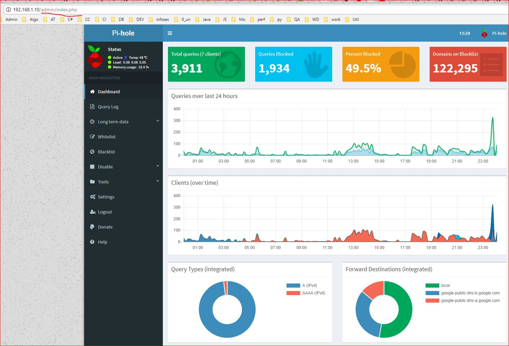
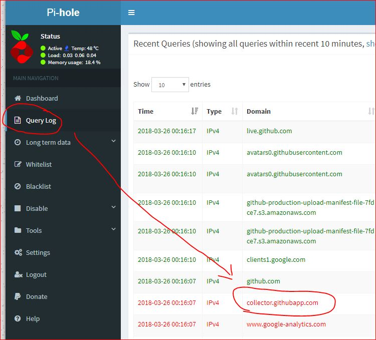

# This All you need to know 

# Step 0
- Make sure you have CURL , so better setup ubuntu with LAMP pre installed. 
- From your router , made fixed IP to connected pc for pihole

# Setup
in you pihole PC (or ssh tunnel) 

curl -sSL https://install.pi-hole.net | bash

And follow up instructions as CLI says. I follow 
1. IP v4
2. Google DNS 
3. static IP address 
4. Admin console instal + logging 

# Change Admin UI password 
After installation complete, you see a predefined password 
use this command to change default password. 

pihole -a -p

# Admin console 
http://your_pihole_pc_ip/admin
use the password that you changed to 
- I do not use pihole DHCP for new network. 
- I use DNS changer in mobile/tab & manually change DNS 
- I also forward port in my router so that I can access my pihole form outside home. 

# Access From any where
- You may configure your router for port forwarding on port 53(default TCP & UDP port for DNS) to access from any where with you router IP. 

# How to use
1. For Android , use DNS changer APP to change DNS 
2. For Windows or Mac , use read google blog  https://developers.google.com/speed/public-dns/docs/using . Just inplace of google DNS use your pi-hole ip (if you port forward , you can use you public IP) 
