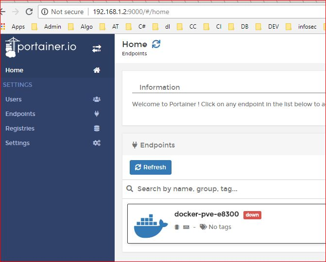

# Portainer for docker
- https://portainer.io/

# install in proxmox 
- Create a data directory 

mkdir /root/portainer/data

- Run Portainer as docker image 

docker run -d -p 9000:9000 -v /root/portainer/data:/data -v /var/run/docker.sock:/var/run/docker.sock portainer/portainer

- Resume initial setup accordingly 

it will look like this 

