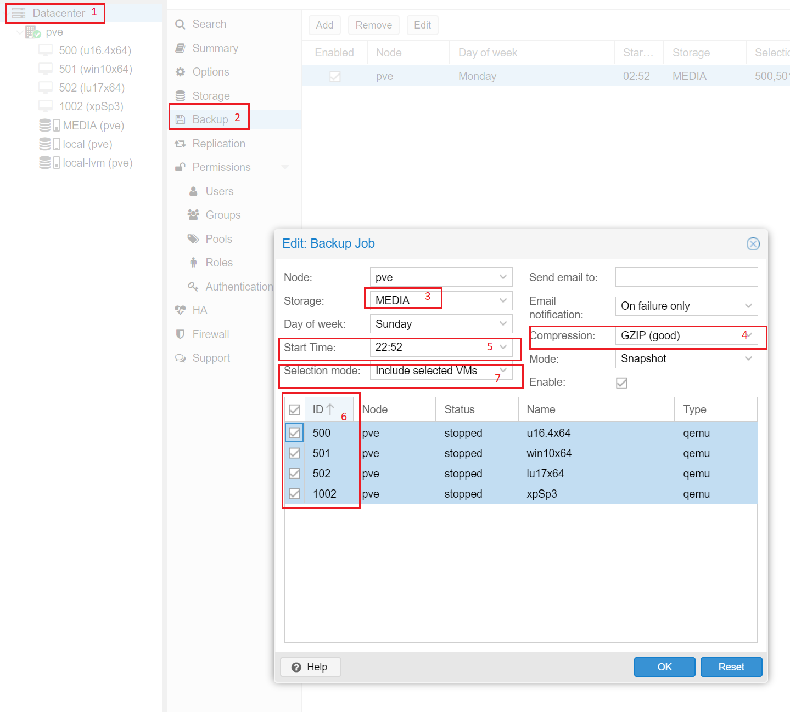

# Backup &  Restore

# Backup

# Restore VMs
qmrestore _backup_file _id_

# Restore Containers 
- pct restore _id_ _restoring_file_from_ --storage _storage_name
Example : 

- pct restore 250 vzdump-lxc-250-2018_06_04-02_18_45.tar.lzo --storage local-lvm

